# [^](README.md) CI/CD

## Lesopname

- [hogent](TODO)
- [panopto](TODO)
- `D:/DATA/Videos/WEBSERVICES/H010_TODO.mp4`

## Wat

Dit hoofdstuk wordt gedeeld tussen de olods Front-end Web Development en Web Services. Onderstaande tabel geeft aan welke secties van toepassing zijn voor welk olod. In de secties waar één olod niet van toepassing is, wordt dit in de tekst ook nog eens expliciet vermeld.

**In dit hoofdstuk werk je uitsluitend met je eigen applicatie**. Het is de bedoeling dat je jouw eigen applicatie online zet. Je kan de voorbeeldapplicatie wel gebruiken als referentie, maar je moet de stappen zelf uitvoeren op jouw eigen applicatie.

| Sectie                          | Front-end Web Development | Web Services        |
|---------------------------------|---------------------------|---------------------|
| Continuous Integration/Delivery | ✅ | ✅  |
| Nodige services                 | ✅ | ✅  |
| Refactoring                     | ✅ | ✅  |
| Render account aanmaken         | ✅ | ✅  |
| Back-end online zetten          | ❌ | ✅  |
| Front-end online zetten         | ✅ | ❌  |
| Hosting remarks                 | ✅ | ✅  |

## Continuous Integration/Delivery

Vroeger werd software geleverd op cd-roms, of zelfs diskettes. De software werd dan op een cd-rom gebrand en naar de klant gestuurd. De klant installeerde de software op zijn computer en kon er vervolgens mee aan de slag. Als er een fout in de software zat, dan moest de software opnieuw gebrand worden en opnieuw naar de klant gestuurd worden. Dit was een tijdrovend proces. Daarom kwamen versies maar eens om de zoveel jaar uit. Een nieuwe versie bevatte dan een 'batch' aan nieuwe functionaliteiten.

Het werk van programmeurs samenbrengen in één werkende applicatie was dan altijd een gedoe. Op welbepaalde tijdstippen werden 'builds' gemaakt met een aantal nieuwe functionaliteiten. Deze builds werden vervolgens getest door een Quality Assurance (QA) team. Als er geen fouten in zaten, werden ze bewaard. Als er toch fouten in zaten, dan moesten de programmeurs opnieuw aan de slag om de fouten te herstellen. Dit was een tijdrovend proces.

Wanneer de deadline van een nieuwe beta versie dichterbij kwam, werd de ontwikkeling van nieuwe features bevroren. Vanaf dan werden enkel nog bugfixes toegevoegd.

Dit proces is niet meer van deze tijd. De klant verwacht dat er regelmatig nieuwe functionaliteiten worden toegevoegd. De klant verwacht ook dat fouten snel worden opgelost. Daarom is het belangrijk dat er regelmatig nieuwe versies van de software worden uitgebracht. Dit proces wordt `Continuous Integration/Continuous Delivery (CI/CD)` genoemd.

Het internet heeft ervoor gezorgd dat updates heel snel kunnen uitrollen. Voor webapplicaties gaat het zelfs zo ver dat men daar niet spreekt over versies. Niemand zal ooit zeggen: "Ik draai nog versie 7 van Facebook, nog geen tijd gehad om naar versie 8 te upgraden.".

Het verschil tussen Continuous Integration (CI) en Continuous Delivery (CD) is dat CI het proces is waarbij de code van verschillende programmeurs samen wordt gebracht in één werkende applicatie. CD is het proces waarbij de applicatie automatisch wordt uitgerold naar de klant. In deze cursus doen we beide, elke nieuwe push naar de main branch zorgt ervoor dat de applicatie automatisch wordt uitgerold.

Al snel bleek dat de manier om software snel in een stabiele staat te krijgen, was om ervoor te zorgen dat de software altijd stabiel was. Het streven wordt om in git (of een ander versiebeheersysteem) altijd een stabiele branch te hebben. Deze branch kan bij wijze van spreken op elk moment uitgerold worden naar de klant. Dit is de master of main branch.

### Feature branches

Als iedereen door elkaar commit op deze branch, lukt dat nooit natuurlijk. Er is dus een andere git-strategie nodig.

<!-- markdownlint-disable -->
<p align="center">
  
</p>
<!-- markdownlint-enable -->

Een mogelijke methode is werken met `feature branches`. Het idee hierachter is dat de main branch altijd stabiel is. Als je aan een feature (of bugfix) start, creëer je een nieuwe branch. Je doet daar al je commits tot het werk af is, voegt testen toe, en merget uiteindelijk alles terug naar de main. Tussendoor kan je zelfs je feature branch rebasen met de main branch of de main branch mergen in jouw feature branch, om zo de nieuwste wijzigingen te hebben voor je de merge doet. Herhaal dit proces voor elke feature.

Het is een best practice om feature branches niet te lang te laten leven. Hoe langer een branch bestaat, hoe lastiger het wordt om deze branch te mergen in de main branch. Mergen is altijd een risico, hoe meer code er veranderd is, hoe groter het risico op fouten. Het is dus beter om `regelmatig heel kleine branches te mergen` dan één grote branch.

### CI/CD pipeline

Nog een stap verder is het automatiseren van het proces. Dit wordt gedaan met een `CI/CD pipeline`. Dit is een geautomatiseerd proces dat de code van de feature branch automatisch test en uitrolt naar de klant. Als er een fout in de code zit, wordt de uitrol naar de klant niet gedaan en krijgt bijvoorbeeld de programmeur hiervan een melding. Als de testen slagen, wordt de code uitgerold naar de klant of bv. naar een deel van de gebruikers.

Het hele concept van CI/CD valt buiten de scope van dit olod. We proberen jullie wel de essentie mee te geven.

## Nodige services

Om de back-end en front-end online te zetten, zijn er een aantal services nodig:

- [Render](https://render.com/)
- MySQL databank in het VIC (= Virtual IT Company van HOGENT): zie mail (ook spam) voor de inloggegevens

> Studenten die reeds geslaagd zijn voor het olod Web Services en een databank nodig hebben om hun back-end van vorig jaar te hergebruiken, gelieve een mail te sturen naar [Thomas Aelbrecht](thomas.aelbrecht@hogent.be).

### Render

Er bestaan heel wat software- en cloudoplossingen om CI/CD toe te passen. Vaak zijn deze oplossingen betalend want een paar virtuele machines opstarten om tests te draaien van een beetje serieuze applicaties is niet gratis natuurlijk.

[Heroku](https://render.com/) had een gratis versie die eenvoudig te gebruiken was, maar die is, jammer genoeg, [verdwenen sinds 28 november 2022](https://dev.to/lukeecart/more-heroku-changes-that-will-definitely-affect-you-10o8).

Daarom maken we vanaf nu gebruik van een all-in-one oplossing, nl. [Render](https://render.com/). De Render omgeving is gratis (tot een bepaalde limiet uiteraard) en biedt meteen een oplossing voor zowel back-end als front-end. Het is ontzettend eenvoudig - een beetje klikken, invullen en klaar.

### MySQL databank in het VIC

Als we onze back-end online willen zetten, hebben we een MySQL databank nodig. Op [Render](https://render.com/) kan je gratis een PostgreSQL databank opstarten, maar wij gebruik MySQL (naar analogie met het olod Databases I). Feel free to switch, but you're on your own then.

Er bestaan heel wat gratis MySQL services online maar eigenlijk geen enkele degelijke waar je geen kredietkaart voor nodig hebt, ofwel zien ze er sketchy uit of zijn ze vaak down.

Daarom hosten we zelf een MySQL databank in het VIC (Virtual IT Company van HOGENT). Jullie krijgen (of kregen) een mail met de inloggegevens van jouw persoonlijke MySQL databank. `Let op: er wordt maar één databank per student voorzien!`

`Dus je moet zelf geen MySQL databank aanmaken!` Droppen van de databank is mogelijk vanuit code, dat kunnen we helaas niet verhinderen. Wil je terug een lege databank? Drop dan simpelweg alle tabellen manueel.

We zijn geen gigantisch datacenter, dus we kunnen niet garanderen dat de databank altijd online zal zijn of snel zal reageren. We doen ons best om de databank zo goed mogelijk online te houden.

Bij problemen met de databank kan je altijd terecht bij [Thomas Aelbrecht](thomas.aelbrecht@hogent.be).

## Refactoring

Deze sectie is verdeeld in een stuk voor de back-end en een stuk voor de front-end. De back-end sectie is enkel van toepassing voor het olod Web Services. De front-end sectie is enkel van toepassing voor het olod Front-end Web Development.

### Back-end

Allereerst moeten we ervoor zorgen dat onze back-end klaar is om in een productie-omgeving te draaien.

#### Dynamisch poortnummer en JWT secret

We moeten eerst een paar kleine aanpassingen doen aan onze code zodat deze werkt in onze productie-omgeving. Wij starten onze server altijd op poort 9000, maar op Render kan je de poort niet zomaar kiezen (je bent niet alleen op de server). Render kiest zelf een poort die het beschikbaar heeft, geeft die door aan je proces, en verwacht dan dat je je daaraan bindt.

Pas daarom de code van de start functie uit src/createServer.ts aan zodat de poort uit configuratie gelezen wordt:

```js
// ... (imports)
import config from 'config'; // 👈

const PORT = config.get<number>('port'); // 👈

return {
  // ...

  start() {
    return new Promise<void>((resolve) => {
      app.listen(PORT); // 👈
      getLogger().info(`🚀 Server listening on http://localhost:${PORT}`); // 👈
      resolve();
    });
  },

  // ...
};
```

Vervolgens zorgen we ervoor dat we de environment variabele `PORT` mappen naar het configuratieproperty `port`. Daarnaast zorgen we er ook voor dat we de environment variabele `AUTH_JWT_SECRET` mappen naar het configuratieproperty `auth.jwt.secret` zodat we het JWT secret kunnen instellen vanuit environment variabelen. Je wil nl. het secret niet publiek in je code hebben staan.

Controleer of het bestand `config/custom-environment-variables.ts` minstens onderstaande inhoud heeft. Je mag dit uiteraard uitbreiden met andere environment variabelen die je nodig hebt in je eigen project.

```ts
export default {
  env: 'NODE_ENV',
  port: 'PORT',
  auth: {
    jwt: {
      secret: 'AUTH_JWT_SECRET',
    },
  },
};
```

Voeg vervolgens poort 9000 toe aan de `alle` configuratiebestanden.

```ts
export default {
  port: 9000,
  // ... (andere properties)
};
```

#### Default configuratie

Je merkt dat we heel wat identieke configuratie op meerdere plekken hebben, dat is niet ideaal. Je kan dit oplossen door een bestand `config/default.ts` toe te voegen met de default configuratie. Vervolgens kan je in elk configuratiebestand enkel de verschillen met de default configuratie opgeven.

Zonder alle gedeelde configuratie af in een bestand `config/default.ts` en pas de andere configuratiebestanden aan zodat ze enkel de verschillen bevatten. Deze properties moet je momenteel minimaal hebben in elk configuratiebestand:

- `config/development.ts`:
  - `auth.jwt.expirationInterval`
  - `auth.jwt.secret`
- `config/production.ts`:
  - `auth.jwt.expirationInterval`
- `config/testing.ts`:
  - `auth.maxDelay`
  - `auth.jwt.expirationInterval`
  - `auth.jwt.secret`

Het secret zetten we niet in de default configuratie omdat we willen dat dit in productie expliciet ingesteld wordt, of een fout oplevert als het niet ingesteld is.

#### Versies van Node.js en Yarn

Het laatste moeten ervoor zorgen dat Render beschikt over de juiste versies van Node.js en Yarn. Voeg onderstaand fragment toe onderaan jouw `package.json`. Voeg eventueel komma's toe om een correct JSON-syntax te krijgen. Uiteraard laat je de buitenste accolades weg! Je kan de versies aanpassen als je dat wenst.

```ts
{
  "engines": {
    "node": "20.6.0",
    "yarn": "4.4.0"
  }
}
```

Nu zijn we klaar om onze back-end online te zetten. `Commit en push deze wijziging`.

### Front-end

Ook hier moeten we ervoor zorgen dat Render beschikt over de juiste versies van Node.js en Yarn. Voeg onderstaand fragment toe onderaan jouw `package.json`. Voeg eventueel komma's toe om een correct JSON-syntax te krijgen. Uiteraard laat je de buitenste accolades weg! Je kan de versies aanpassen als je dat wenst. `Commit en push deze wijziging!`

```ts
{
  "engines": {
    "node": "20.6.0",
    "yarn": "4.4.0"
  }
}
```

## Render account aanmaken

De volgende stap is het aanmaken van een Render account. Ga naar [Render](https://render.com/) en klik op "Sign In" rechtsboven.

<!-- markdownlint-disable -->
<p align="center">
  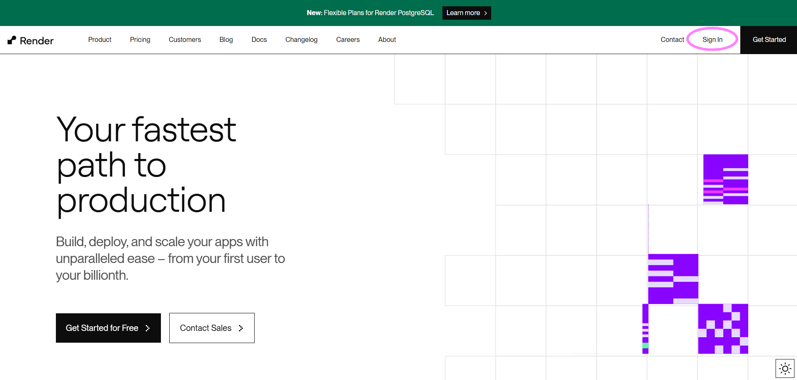
</p>
<!-- markdownlint-enable -->

Kies voor "GitHub" als authenticatiemethode en volg de stappen van de wizard. Als je niet voor GitHub kiest, heb je geen toegang tot jouw repositories in onze classroom. Na het aanmaken van je account krijg je een verificatiemail, klik op de link.

<!-- markdownlint-disable -->
<p align="center">
  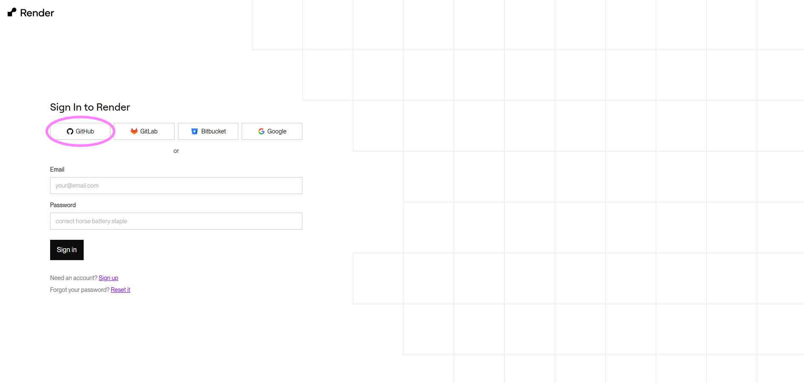
</p>
<!-- markdownlint-enable -->

Na verificatie van je account kom je terecht op je dashboard.

<!-- markdownlint-disable -->
<p align="center">
  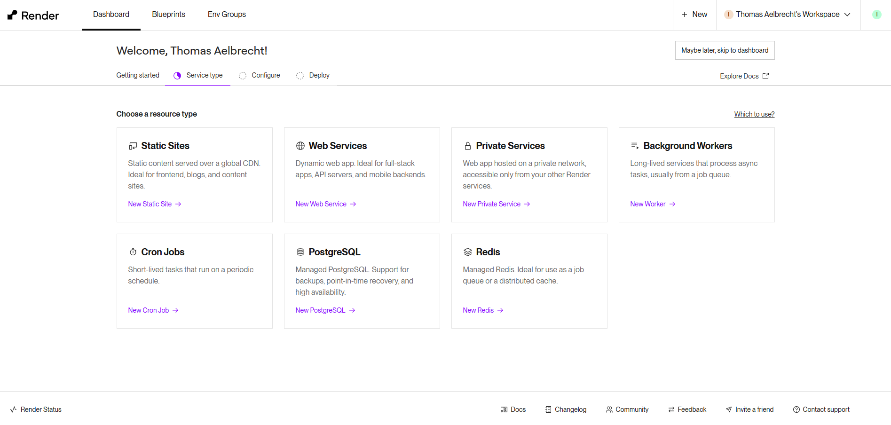
</p>
<!-- markdownlint-enable -->

## Back-end online zetten

> `Let op!` Deze sectie is `niet` van toepassing voor het olod Front-end Web Development.

We zetten eerst de back-end online, klik op "New Web Service".

<!-- markdownlint-disable -->
<p align="center">
  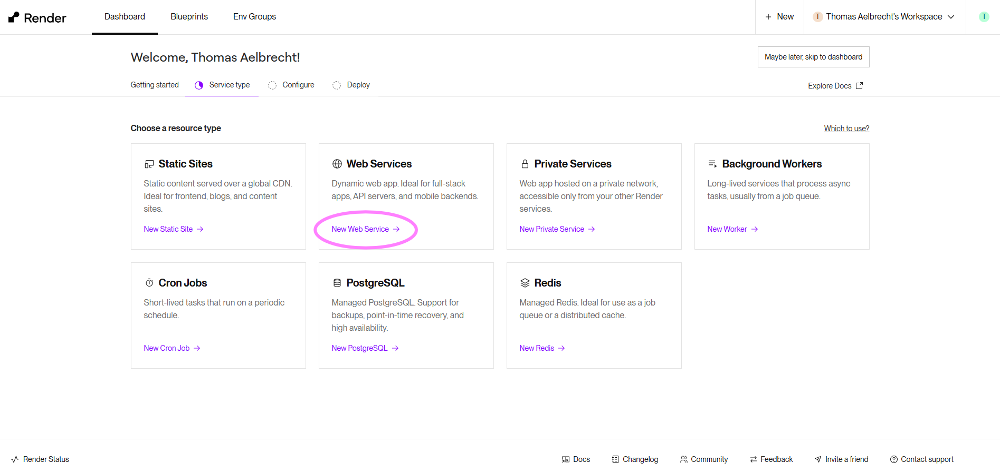
</p>
<!-- markdownlint-enable -->

Zoek jouw `eigen` back-end repository op, selecteer deze en klik op "Connect".

<!-- markdownlint-disable -->
<p align="center">
  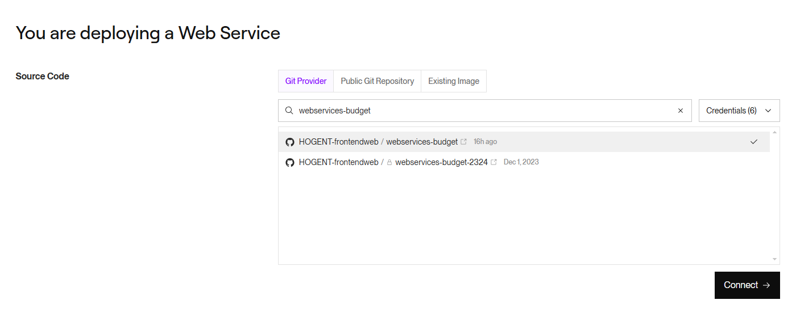
</p>
<!-- markdownlint-enable -->

Vul vervolgens alle nodige settings in:

- Kies een unieke naam voor je service (hint: je repository-naam is uniek).
- Maak eventueel een project aan zodat alle resources van je applicatie gegroepeerd zijn.
- Kies "Frankfurt (EU Central)" als regio.
- Vul bij "Root Directory" de naam van de map in waar je back-end code staat. Dit is de map waarin je `package.json` staat. Indien alles in de root staat, laat je dit veld leeg.
- Vul `corepack enable && yarn install && yarn build && yarn prisma migrate deploy` in bij "Build Command". Dit is het commando dat Render zal uitvoeren om je back-end te bouwen. We zorgen ervoor dat we Yarn v2 kunnen gebruiken, installeren eerst onze dependencies, bouwen vervolgens onze applicatie en migreren onze databank.
  - Wens je de databank te resetten? Voer dan lokaal `yarn prisma migrate reset --force` uit maar dan met de juiste `DATABASE_URL` in je `.env` bestand. **`Gebruik dit commando NOOIT in de instellingen van Render`**! Je gooit hiermee de hele databank weg en dat is niet de bedoeling.
- Vul `node build/src/index.js` in bij "Start Command". Dit is het commando dat Render zal uitvoeren om je back-end te starten. We starten onze back-end vanuit de `build` directory.
- Kies tenslotte voor "Free" als plan. Dit is het gratis plan van Render. Dit is voldoende voor onze applicatie. Hierdoor wordt jouw applicatie wel afgesloten indien er geen activiteit is, dus het kan even duren vooraleer de back-end online is.

De rest zou normaal correct ingevuld moeten zijn. **`Controleer dit voor jouw situatie`**.

<!-- markdownlint-disable -->
<p align="center">
  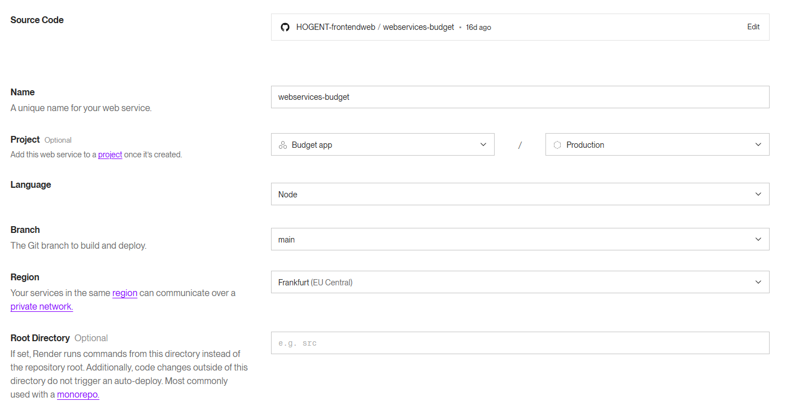
</p>
<p align="center">
  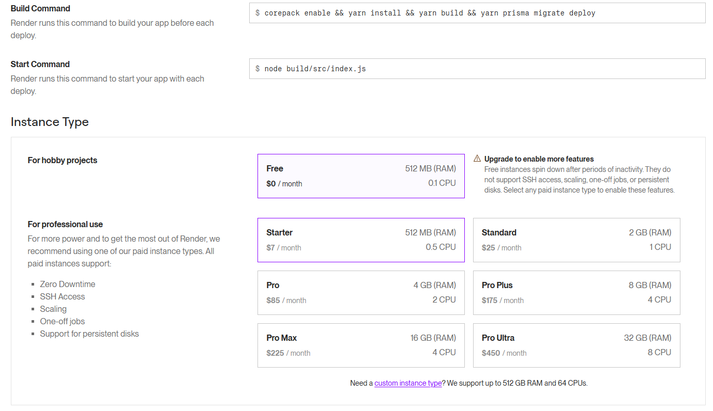
</p>
<!-- markdownlint-enable -->

Vul onder de instance types de nodige environment variabelen in. Check je mail voor de nodige credentials voor jouw persoonlijke databank. Als je authenticatie en autorisatie hebt, moet je deze environment variabelen ook nog toevoegen.

> Hint: voor de variabele AUTH_JWT_SECRET kan je een random string gebruiken. Klik op "Generate" om een random string te laten genereren door Render.

<!-- markdownlint-disable -->
<p align="center">
  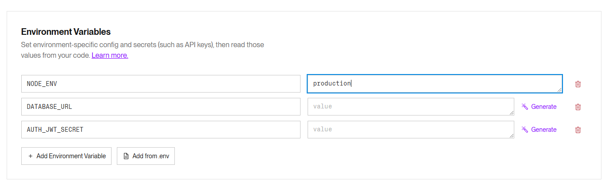
</p>
<!-- markdownlint-enable -->

Optioneel kan je onder "Advanced" een "Health Check Path" invullen. Dit is een URL die je kan gebruiken om te controleren of je service nog online is, bij ons is dit `/api/health/ping`.

<!-- markdownlint-disable -->
<p align="center">
  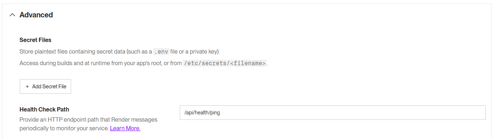
</p>
<!-- markdownlint-enable -->

Klik vervolgens op "Deploy Web Service" en wacht geduldig af (het gratis plan kan trager zijn). Als alles goed is gegaan, zou je nu een werkende back-end moeten hebben. De URL van jouw back-end vind je linksboven.

<!-- markdownlint-disable -->
<p align="center">
  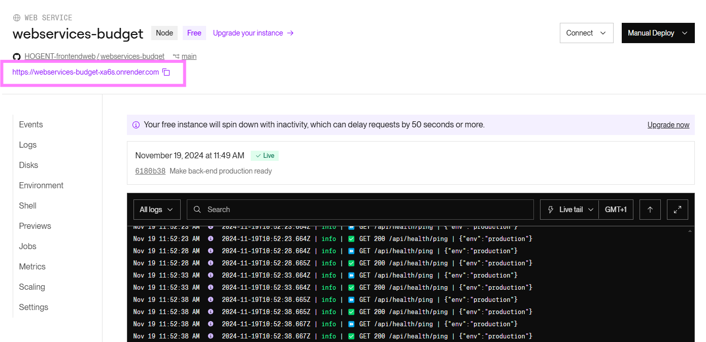
</p>
<!-- markdownlint-enable -->

**`Lees eerst de logs alvorens de lectoren te contacteren`**! Krijg je het niet werkende? Maak een issue op jouw repository en tag jouw lector. Voeg een kopie van je logs en je settings (zonder secrets) toe, anders kunnen we niet helpen.

<!-- markdownlint-disable -->
<p align="center">
  
</p>
<!-- markdownlint-enable -->

## Front-end online zetten

> Let op! Deze sectie is niet van toepassing voor het olod Web Services.

Het is tijd om onze front-end online te zetten. Onze front-end is (na het builden) niet meer dan een statische website met wat HTML, JS, CSS... Veel hebben we hiervoor dus niet nodig.

Open het Render dashboard en klik rechtsboven op "+ New" en "Static Site" (of klik op "New Static Site" indien je geen back-end hebt).

<!-- markdownlint-disable -->
<p align="center">
  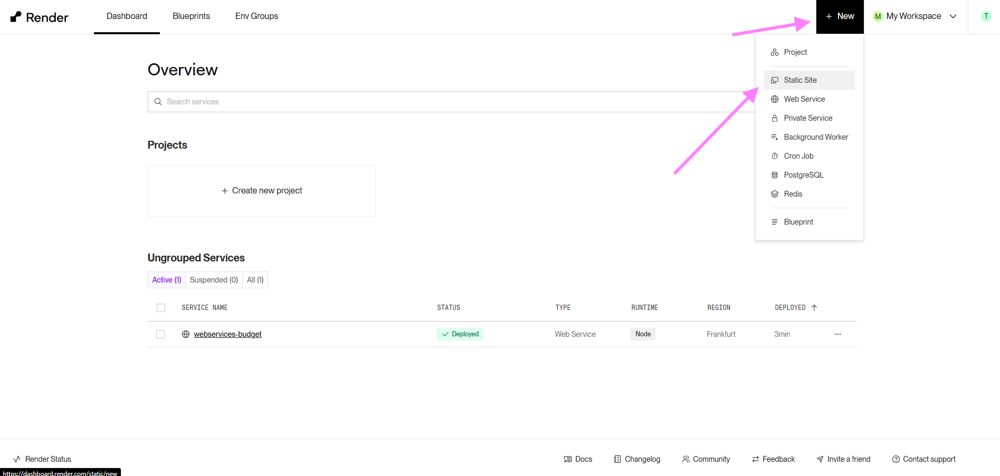
</p>
<!-- markdownlint-enable -->

Zoek nu jouw `eigen` front-end repository op en klik op "Connect"

<!-- markdownlint-disable -->
<p align="center">
  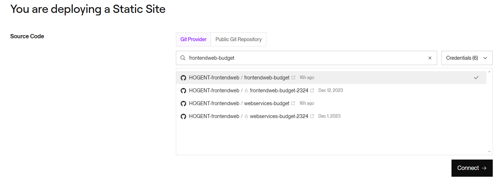
</p>
<!-- markdownlint-enable -->

Vul vervolgens alle nodige settings in:

- Kies een unieke naam voor je statische website (hint: je repository-naam is uniek).
- Selecteer eventueel een project.
- Vul bij "Root Directory" de naam van de map in waar je front-end code staat. Dit is de map waarin je `package.json` staat. Indien alles in de root staat, laat je dit veld leeg.
- Vul `corepack enable && yarn install && yarn build` in bij "Build Command". Dit is het commando dat Render zal uitvoeren om je front-end te bouwen. We zorgen ervoor dat we Yarn v2 kunnen gebruiken, installeren eerst onze dependencies en bouwen vervolgens onze applicatie.
- Vul `dist` in bij de "Publish directory".

De rest zou normaal correct ingevuld moeten zijn. **`Controleer dit voor jouw situatie`**.

<!-- markdownlint-disable -->
<p align="center">
  
</p>
<!-- markdownlint-enable -->

We moeten onze front-end nog vertellen waar onze back-end draait. Dit doen we door een environment variabele in te stellen. Kopieer de URL van jouw back-end van het Render dashboard naar een environment variabele met naam `VITE_API_URL`. Vergeet niet `/api` toe te voegen aan het einde van de URL, tenzij je dit anders aangepakt hebt in jouw applicatie. Daarnaast voegen we ook `SKIP_INSTALL_DEPS` toe met waarde true zodat Render onze dependencies niet automatisch installeert. Indien dit wel zou gebeuren, zou dit een foutmelding geven omdat corepack nog niet ingeschakeld is.

<!-- markdownlint-disable -->
<p align="center">
  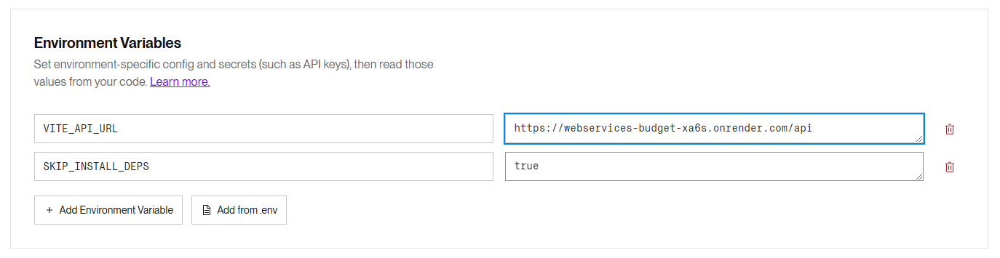
</p>
<!-- markdownlint-enable -->

Klik vervolgens op "Deploy Static Site" en wacht geduldig af (het gratis plan kan trager zijn). Als alles goed is gegaan, zou je nu een werkende front-end moeten hebben. De URL van jouw front-end vind je linksboven.

<!-- markdownlint-disable -->
<p align="center">
  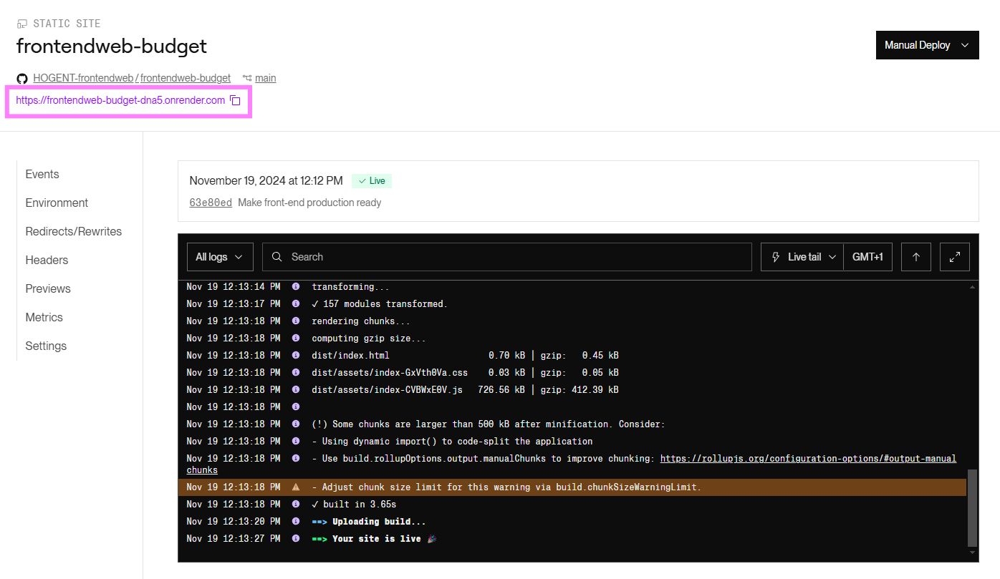
</p>
<!-- markdownlint-enable -->

### CORS probleem

Je kan nu alvast naar jouw front-end gaan maar je zal merken dat er nog een probleem is. Probeer bijvoorbeeld een gebruiker te registreren (of een ander request uit te voeren) en bekijk de console. Je krijgt een CORS error, dit moeten we gaan fixen in de back-end!

<!-- markdownlint-disable -->
<p align="center">
  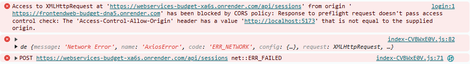
</p>
<!-- markdownlint-enable -->

CORS kan je enkel oplossen door in de back-end de juiste headers te zetten. We hadden reeds ons CORS package geconfigureerd en moeten enkel de URL aanpassen in het bestand `config/production.ts`. Voeg jouw eigen front-end URL toe aan de `cors.origins` array.

> Merk dus op dat je een CORS-probleem niet kan oplossen in de front-end of als je geen toegang hebt tot de back-end!

```ts
// config/production.ts
export default {
  cors: {
    origins: ['https://frontendweb-budget-dna5.onrender.com'], // 👈
  },
  // ...
};
```

**`Commit en push`** deze wijziging. Wacht tot de back-end opnieuw online is en herlaad de front-end. De CORS error zou nu weg moeten zijn.

### 404 probleem

Probeer nu op jouw front-end rechtstreeks naar een URL verschillend van `/` te gaan. In ons voorbeeld gaan we naar `/transactions`. Je zal merken dat je een 404 krijgt. Dit moeten we oplossen in de front-end!

Ga naar het Render dashboard van jouw front-end en klik op "Redirects/Rewrites". Voeg een nieuwe Rewrite-regel toe zoals op onderstaande afbeelding. Klik vervolgens op "Save Changes". Je kan meteen testen of het werkt! Deze regel zorgt ervoor dat alle requests naar de front-end die niet naar `/` gaan, als antwoord de `index.html` van de front-end krijgen. [Lees meer over het verschil tussen redirects en rewrites](https://render.com/docs/redirects-rewrites).

<!-- markdownlint-disable -->
<p align="center">
  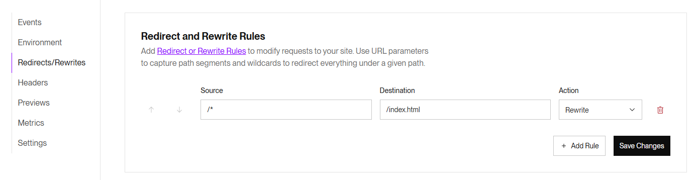
</p>
<!-- markdownlint-enable -->

## Hosting remarks

Dit was maar een (eenvoudig) voorbeeld om je applicatie online te zetten. Onze hoofdbekommernis was bovendien om alles 100% gratis te kunnen regelen, wat niet altijd het eenvoudigst of handigst is.

Hier linten of testen we onze applicatie ook niet voor we deze online zetten. We merken het dus niet op als onze applicatie een bug heeft die door de testen opgevangen zou worden.

Als je ooit echte applicaties online wil zetten, kijk dan eerst eens rond. Er zijn veel opties, en vaak helemaal niet duur meer maar zelden helemaal gratis. Vaak zal de CI/CD pipeline veel meer omvatten dan louter builden en online plaatsen.

Op Render wordt ook de complexiteit van de CI/CD pipeline niet getoond. Je moet slechts een paar veldjes invullen en Render doet alle magie voor jou. Dit is natuurlijk niet realistisch. Als je ooit een echte applicatie online zet, zal je zelf een CI/CD pipeline moeten opzetten. Dit is een hele klus en je zal er veel tijd in moeten steken. Het is echter wel de moeite waard, want het zal je veel tijd besparen in de toekomst.

Denk bij het online zetten van een applicatie ook altijd na over reproduceerbaarheid. Als je een applicatie online zet, moet je ervoor zorgen dat je dit opnieuw kan doen. Dit betekent dat je alles moet documenteren en automatiseren. Als je dit niet doet, zal je in de toekomst veel tijd verliezen. In dit hoofdstuk hebben we alles manueel gedaan, maar in een realistisch project zal je dit automatiseren met bv. [Terraform](https://www.terraform.io/), [Ansible](https://www.ansible.com/) of een andere tool. Zo kan je met één commando de hele infrastructuur opzetten.

## Oefening 1 - README

Pas vervolgens jouw README aan met de nodige commando's... om de applicatie in productie op te starten. Je kan inspiratie opdoen in de README's van de voorbeeldapplicaties.

## Oefening 2 - Optimalisatie TypeScript build back-end

Je zal zien dat onze build van de back-end onze testbestanden en de Jest configuratie bevat. Dit is niet nodig in productie. Pas de `tsconfig.json` aan zodat deze bestanden niet in de build terechtkomen.

> Oplossing

Voeg een exclude property toe in `tsconfig.json` (of pas deze aan):

```ts
{
  "exclude": ["jest.config.ts", "__tests__"]
}
```

## Eindpunt voorbeeldapplicatie

De `main` branch bevat de finale versie van de voorbeeldapplicatie voor beide olods.

Laatste aanpassing op 27/06/2025 11:38
