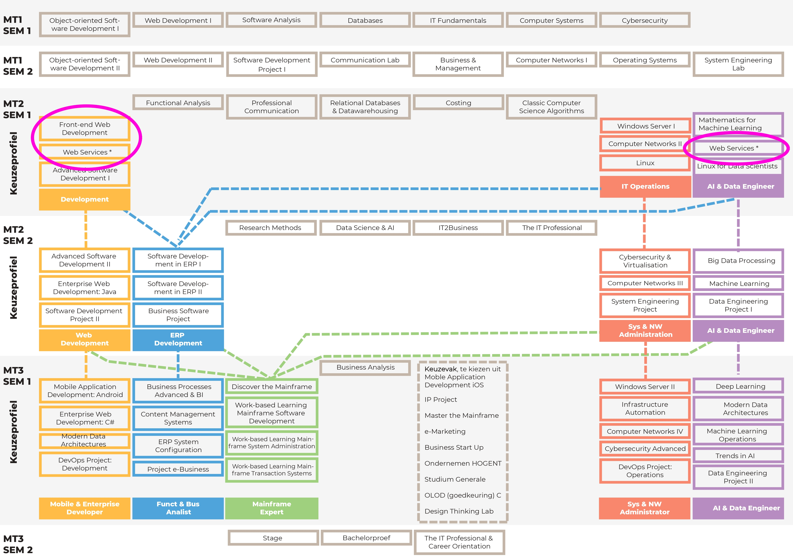

# [^](../README.md) Algemene info

## Lesopname

- [hogent](https://chamilo.hogent.be/index.php?go=CourseViewer&application=Chamilo%5CApplication%5CWeblcms&course=61464&tool=LectureCapture&browser=Hogent%5CApplication%5CWeblcms%5CTool%5CImplementation%5CLectureCapture%5CRenderer%5CVideoPublicationListRenderer&tool_action=viewer&publication=2410884)
- [panopto](https://hogent.cloud.panopto.eu/Panopto/Pages/Viewer.aspx?id=174ed677-dea0-4f16-bd21-b1f700f6a6f1&start=0)
- `D:/DATA/Videos/WEBSERVICES/H0_Algemene_info_en_examenopdracht.mp4`

## Situering

Dit olod behoort tot de keuzepakketten **Development** en **AI & Data Engineer**, zoals je hieronder kan zien:

<!--

-->
<!-- markdownlint-disable -->

  

<!-- markdownlint-enable -->

Indien je in het keuzepakket **Development** zit, dan volg je waarschijnlijk Front-end Web Development gelijktijdig met dit olod. Indien je in het keuzepakket **AI & Data Engineer** zit, dan volg je enkel dit olod.

## Wat gaan we doen?

Concreet maken we een back-end met JavaScript, meer specifiek TypeScript. Er zijn ontzettend veel frameworks en libraries om een back-end te maken, elk met hun eigen voor- en nadelen.

Wij hebben gekozen voor Koa. Waarom? Het is van de makers van het populaire Express. Jammer genoeg wachten we al jaren op versie 5 van Express en heeft die nog steeds geen native ondersteuning voor async/await. Koa heeft dit wel en bevat standaard niks. Daarom is dit een goeie library om met niets te starten en enkel de nodige dingen toe te voegen.

## Wat gaan jullie doen?

Programmeren leer je enkel door het te doen, niet door onze cursus te lezen. Je zal bijgevolg merken dat in het cursusmateriaal enkel het absolute minimum s
Voor dit olod is er een [examenopdracht](03_examenopdracht.md). Kort gezegd moet je een Node.js back-end maken tegen week 13. De voorwaarden van deze back-end en de examenvorm staan duidelijk in de opdracht. De bijbehorende front-end maak je, indien van toepassing, in het olod Front-end Web Development.

De Chamilo-cursus vind je [hier](https://chamilo.hogent.be/index.php?application=Chamilo%5CApplication%5CWeblcms&go=CourseViewer&course=61464). Hierin komen alle belangrijke aankondigingen, een link naar de cursus en een uploadmodule voor de examenopdracht. Op de cursus zal je ook een link naar de GitHub-classroom zien verschijnen. Zonder repository in deze classroom kunnen wij niet aan je code en kan je hierop dus niet geëvalueerd worden.

### Deadline

> Week 13: vrijdag 20 december 2024 om 23u59

Je weet de deadline, plan je werk goed in! Wacht niet tot de laatste paar weken om te starten, dan zal je gegarandeerd in tijdsnood komen. Tijdens de lessen is ook voldoende tijd om aan de applicatie te werken, maak hier gebruik van!

### Voorbeelden

Naar goeie traditie schrijven we hier enkele voorbeelden van jullie voorgangers. Imponeer ons en mogelijks komt jouw idee hier te staan:

- Auto-verhuur
- Stockbeheer voor het IT-lab
- Chat-applicatie (met WebSockets)
- Beheer van verzamelingen (zeldzame strips, antiek...)
- Websites om te zoeken/luisteren naar podcasts
- Quiz-applicatie
- Website voor een vereniging of het bedrijf van een vriend(in), familielid...

## Cursusmateriaal?

Het cursusmateriaal wordt op GitHub gehost: [https://HOGENT-frontendweb.github.io/webservices-cursus](https://HOGENT-frontendweb.github.io/webservices-cursus).

Er is een voorbeeldapplicatie (stap per stap opgebouwd, zoals in de cursus): [https://github.com/HOGENT-frontendweb/webservices-budget](https://github.com/HOGENT-frontendweb/webservices-budget).

De bijhorende front-end is te vinden op: [https://github.com/HOGENT-frontendweb/frontendweb-budget](https://github.com/HOGENT-frontendweb/frontendweb-budget).

Vanaf dit academiejaar worden de voorbeeldapplicatie en cursus van dit olod stelselmatig omgevormd naar TypeScript. Het merendeel van de hoofdstukken is al omgezet, maar nog niet alles. We geven duidelijk aan wanneer een hoofdstuk nog niet omgezet is (**WIP** naast de titel). Wees dus niet verrast als een hoofdstuk nog in JavaScript is of er plots helemaal anders uitziet.

> Suggesties voor verbeteringen of aanpassingen van schrijffouten zijn altijd welkom! Maak hiervoor een issue of pull request op de GitHub-repository van de cursus: [https://github.com/HOGENT-frontendweb/webservices-cursus](https://github.com/HOGENT-frontendweb/webservices-cursus).

## Planning

Deze planning is een richtlijn en kan nog wijzigen in functie van verlofdagen.

| Week     | Inhoud                                           |
|----------|--------------------------------------------------|
| week 1   | Inleiding, TypeScript                            |
| week 2   | TypeScript, REST API intro                       |
| week 3   | REST API intro + bouwen                          |
| week 4   | REST API bouwen                                  |
| week 5   | Datalaag en CRUD                                 |
| week 6   | Datalaag en CRUD                                 |
| week 7   | (geen nieuwe theorie, aan de opdracht werken)    |
| week 8   | Testen                                           |
| week 9   | Validatie en foutafhandeling                     |
| week 10  | Authenticatie / autorisatie                      |
| week 11  | Testen authenticatie / autorisatie + Swagger     |
| week 12  | CI/CD (= online zetten)                          |

## Help, ik zit vast?

Lees de foutboodschappen, copy-paste ze in Google. Vaak 'helpen' we studenten door de fout te copy-pasten en de eerste link in Google te kopiëren.

### Het werkt niet maar geen error te zien?

- eerst en vooral stappen vinden die het probleem reproduceren
- dan het probleem proberen isoleren (databank? back-end? front-end?)
- gebruik een debugger, log statements; denk even na

### Nog altijd vast?

- maak een GitHub issue op jouw repository
- vul een van de gegeven templates in
  - **let op**: dit is NIET een bestand in de map .github/ISSUE_TEMPLATE aanpassen, deze laat je gewoon staan!
  - lees dit: [https://docs.github.com/en/issues/tracking-your-work-with-issues/creating-an-issue](https://docs.github.com/en/issues/tracking-your-work-with-issues/creating-an-issue)
- link jouw lector aan dit issue (als assignee en/of getagd)
  - anders krijgen we geen melding van jouw issue en kunnen we je niet helpen

Laatste aanpassing op 09/12/2024 14:16
